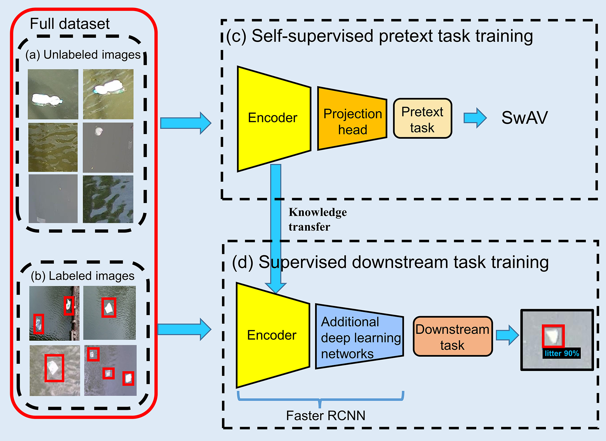

# Detection of floating litter with semi-supervised learning method

This repository contains the code used for the following publication:
```bash
Jia, T., de Vries, R., Kapelan, Z., van Emmerik, T. H., & Taormina, R. (2024). Detecting floating litter
in freshwater bodies with semi-supervised deep learning. Water Research, 266, 122405.
```

The aim of this study is to propose a semi-supervised learning method to detect floating litter, and assess its effectiveness and generalization capability. We also test against the same Faster R-CNN architecture trained using Supervised Learning (SL) method alone and ImageNet pre-trained weights. 




Acknowledgement:

This project was inspired by the work of Facebook AI Research and the [Vissl v0.1.6](https://github.com/facebookresearch/vissl) library. 
Learn more about VISSL at [documentation](https://vissl.readthedocs.io). And see the [projects/](projects/) for some projects built on top of VISSL.

## Installation

See [`INSTALL.md`](./INSTALL.md).

## Usage

-  Step 1: Pre-train models using a self-supervised learning method, i.e., SwAV, (see `main_Self_Supervised_Train_.ipynb`).
-  Step 2: Fine-tune the models obtained from Step 1 using in a supervised learning method for object detection (see `main_Fine_tune_for_object_detction.ipynb`).
-  Step 3: Evaluate model performnaces on test sets for object detection, e.g., AP50, and predicting images (see `main_Evaluate_Object_Detection.ipynb`).
-  Step 4: Output confusion matrix on test sets for object detection, e.g., TP, FP, and FN (see `main_Confusion_matrix_OD.ipynb`).

## Citing this project or paper

If you find this project is useful in your research or wish to refer to the paper, please use the following BibTeX entry.

```bash
Jia, T., de Vries, R., Kapelan, Z., van Emmerik, T. H., & Taormina, R. (2024). Detecting floating litter
in freshwater bodies with semi-supervised deep learning. Water Research, 266, 122405.
```

```BibTeX
@article{jia2024detecting,
  title={Detecting floating litter in freshwater bodies with semi-supervised deep learning},
  author={Jia, Tianlong and de Vries, Rinze and Kapelan, Zoran and van Emmerik, Tim HM and Taormina, Riccardo},
  journal={Water Research},
  volume={266},
  pages={122405},
  year={2024},
  publisher={Elsevier}
}
```

## Contact

➡️ Tianlong Jia ([tianlong.jia@kit.edu](mailto:tianlong.jia@kit.edu))
